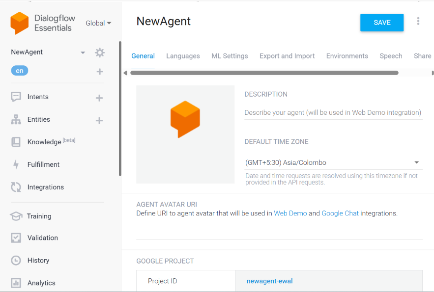
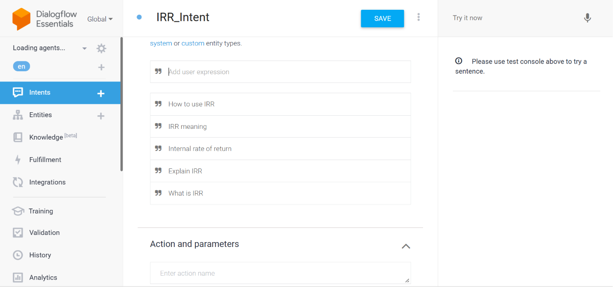
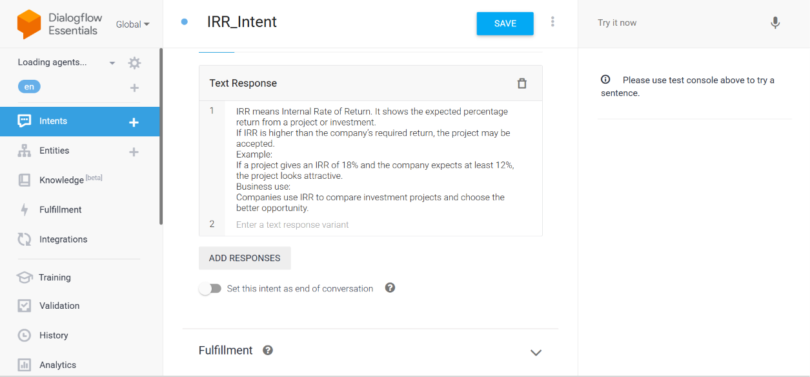
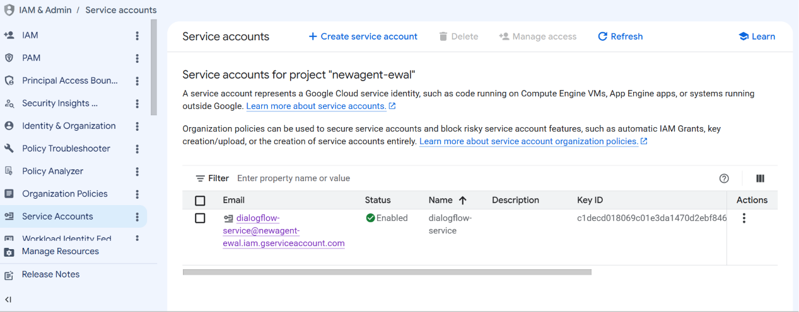
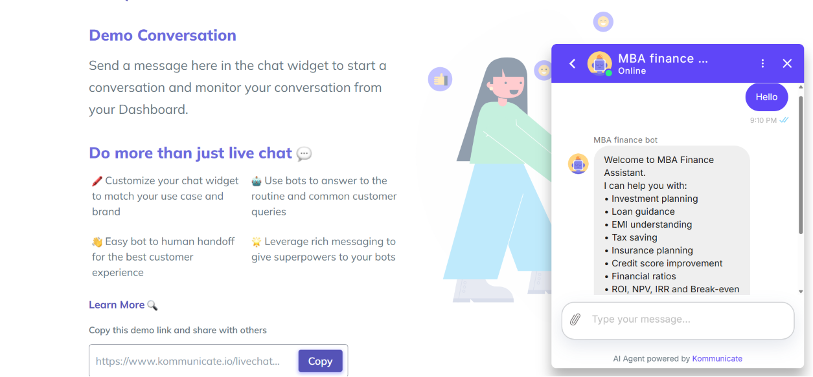
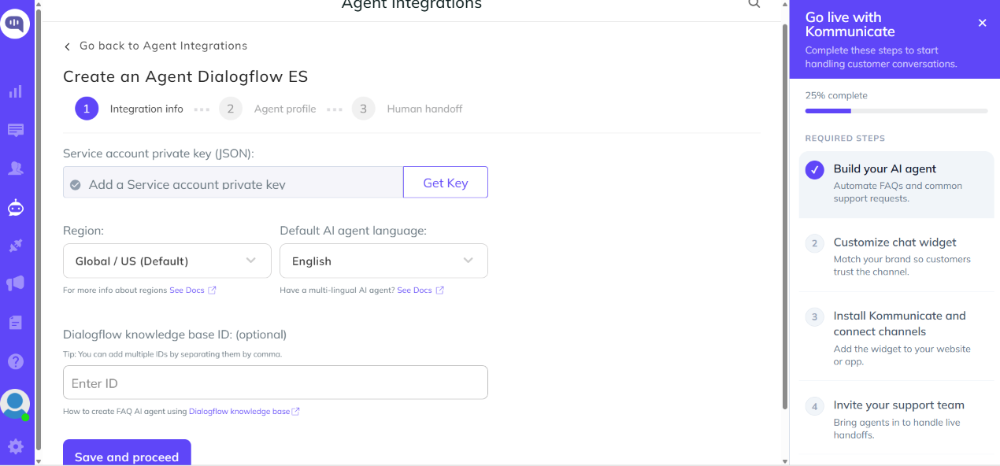
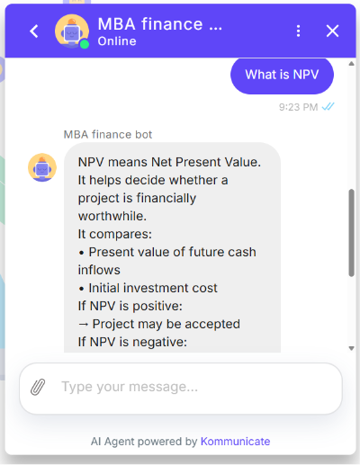

# Finance Chatbot using Dialogflow and Kommunicate

## Project Overview
AI-powered Finance Chatbot built using Dialogflow ES and deployed through Kommunicate.

## Technologies Used
- Dialogflow ES
- Google Cloud Platform
- Kommunicate
- Conversational AI

## Features
- NPV Calculator
- IRR Explanation
- Loan Advisor
- Investment Advisor
- Tax Saving Advisor
- Budget Planner

## Screenshots

### Agent Creation

### Intent List

### NPV Intent Training Phrases

### NPV Intent Response

### Try It Now Testing

### Kommunicate Setup

### Live Chatbot Testing

## Live Demo
https://www.kommunicate.io/livechat-demo?appId=8a2fab07b0289155890e23bdd3bb7a58&botIds=mba-finance-bot-1op0q&assignee=mba-finance-bot-1op0q

## Author
Khushi lathwal
MBA Applied Finance, Chitkara University
